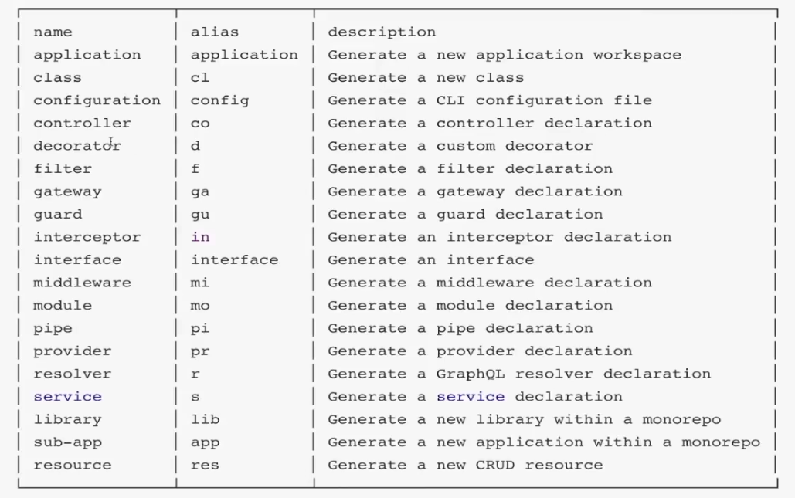

# 约定大于配置

## 作者推荐

<https://github.com/nestjs/nest/issues/2249>

- src
  - core 源码
  - common
    - middleware
    - interceptors
    - guards
  - user
    - interceptors (scoped interceptors)
    - user.controller.ts
    - user.model.ts
  - store
    - store.controller.ts
    - store.model.ts
- 可以使用 monorepo 方法，在一个 repo 中创建两个项目，并在他们之间共享相同的东西，如库/包。
- 没有模块目录，按照功能进行划分
- 把通用/核心的东西归为单独的目录：common，如：拦截器/守卫/管道

## 代码规范 风格指南

[Angular 风格指南](https://angular.cn/guide/styleguide)

### 总则

- 每个文件只定义一样东西（例如服务或者组件）
- 把文件限制在 400 行代码以内
- 定义简单函数
- 限制在 75 行之内

### 命名

- 所有符号使用一致的命名规则
- 遵循同一个模式来描述符号的特性和类型

### 使用点和横杠来分割文件名

- 在描述性名字中，用横杠来分割单词
- 在使用点来分割描述性名字和类型
- 遵循先描述组件特性，再描述它的类型的模式，对所有组件使用一致的类型命名规则。推荐的模式为 feature.type.ts
- 使用惯用的后缀描述类型。包括 *.service *.componet *.pipe *.module *.directive。必要时可以创建更多类型名。

### 符号名与文件名

- 为所有东西使用一致的命名约定，以他们所代表的东西命名
- 使用大写驼峰命名法来命名类
- 匹配符号名与它所在的文件名
- 在符号名后面追加约定的类型后缀（如Component、Directive、Module、Pipe、Service）
- 在文件名后面追加约定的类型后缀（如.component.ts、.directive.ts、.module.ts、.pipe.ts、.service.ts）
- 使用中线命名法，来命名组件的元素选择器