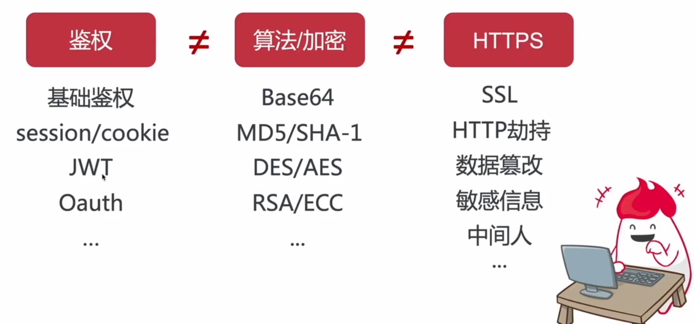
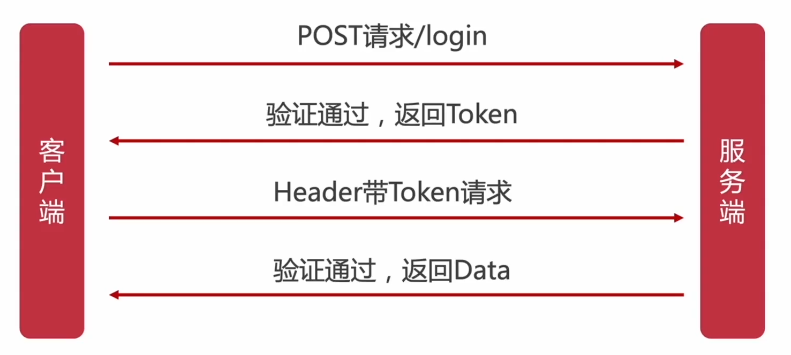

## Session & Cookie

- 优点
  - 较易扩展
  - 简单
- 缺点
  - 安全性低
  - 性能低，服务端存储
  - 多服务器同步 session 困难
  - 跨平台困难
  
## Json Web Token

- 优点
  - 易扩展
  - 支持多端，移动设备
  - 跨应用调用
  - 安全
  - 承载信息丰富
  
- 缺点
  - 刷新与过期处理
  - payload不易过大
  - 中间人攻击

## Oauth

- 优点 
  - 开放
  - 安全
  - 简单
  - 权限制定
- 缺点
  - 需要增加授权服务器
  - 增加网络请求
  
## 核心概念

### JWT特点

- 防CSRF 主要是防伪造请求，带上Cookie
- 适合移动应用
- 无状态，编码数据

### 工作原理

Nestjs 核心概念

- 控制器 Controller 处理请求
- 服务 Services 处理业务逻辑
- 模块 Modules 组合所有的逻辑代码
- 实体 Entity 数据模型
- 管道 Pipes 核验请求的数据
- 过滤器 Filters 处理请求时的错误
- 守卫 Guards 鉴权与认证相关
- 拦截器 Interceptors 给请求与响应加入额外的逻辑
- Repositories 处理在数据库中的数据

### 中间件 Middleware

- 全局中间件
- 局部中间件